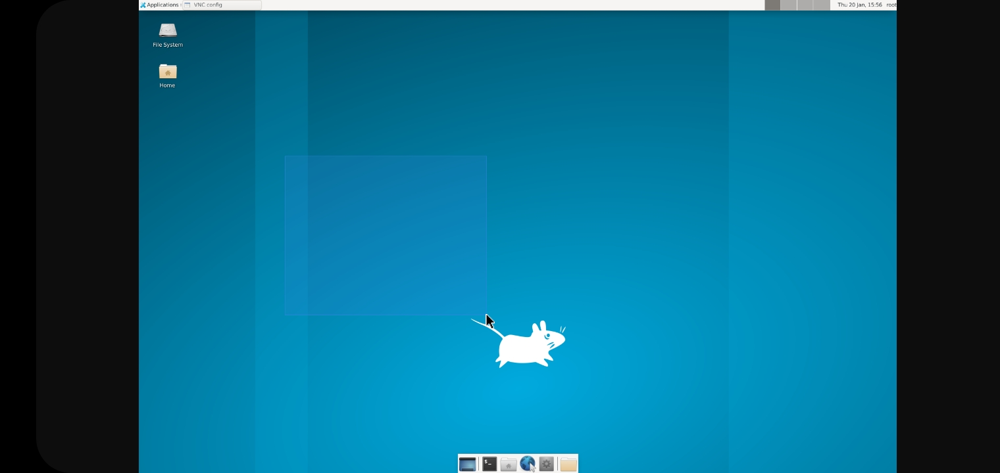
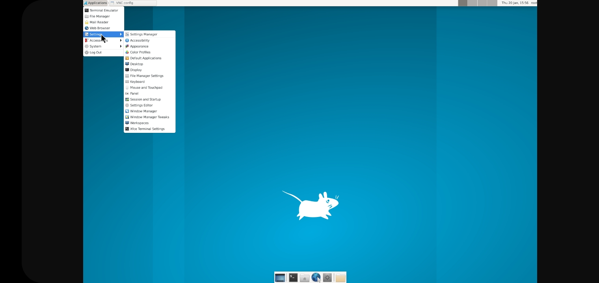
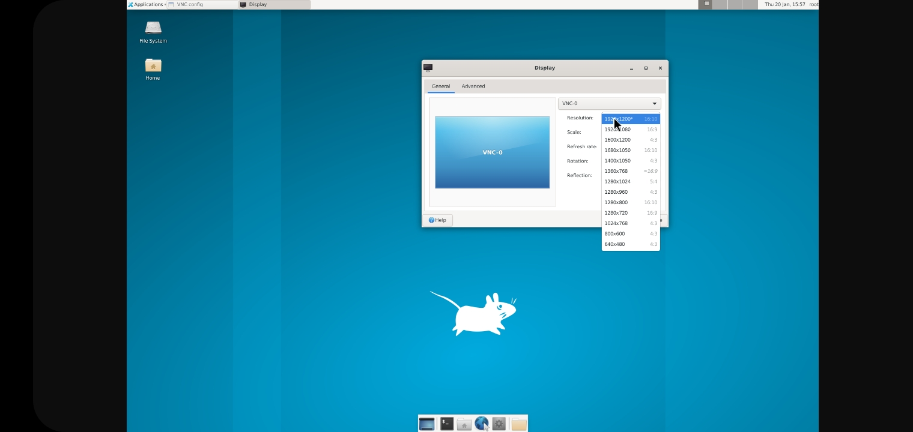
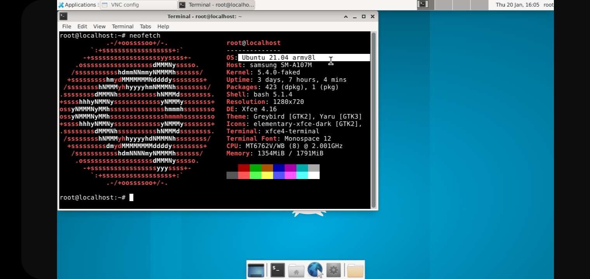

# termux-desktop
Esse repository* foi criado a fim de te ensinar a instalar um desktop automaticamente no seu termux

#**PASSO1**

#digite:

#**-----------------------**

pkg install wget; wget https://raw.githubusercontent.com/GitHub059/termux-desktop/main/desk.sh && bash desk.sh

#**-----------------------**

*pacotes adicionais "apt install xfce4-terminal firefox xfce4-taskmanager nano wget git vim"
  
  
#**dica:** depois de finalizado, reinicie o termux e dê termux-setup-storage para acessar seu armazenamento interno

*AQUI ESTÃO ALGUNS PRINTS*

#ELE JÁ VEM COM PULSE AUDIO INSTALADO E CONFIGURADO
#BASTA BAIXAR ELE NO UBUNTU 21 

